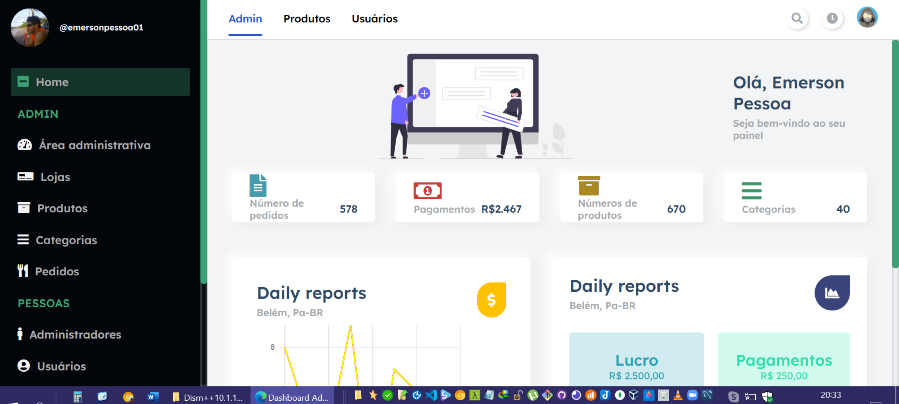
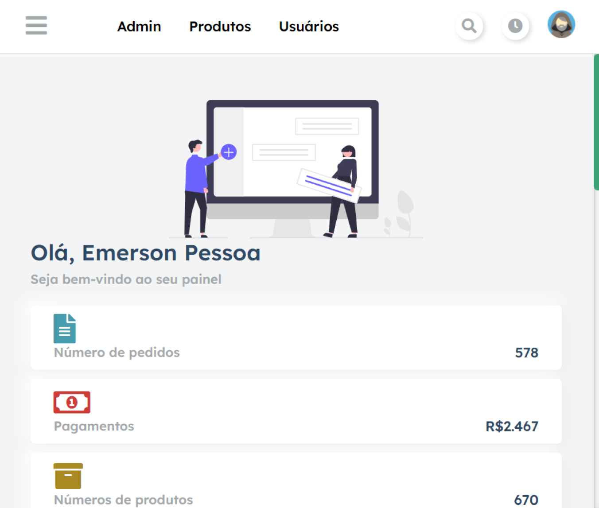
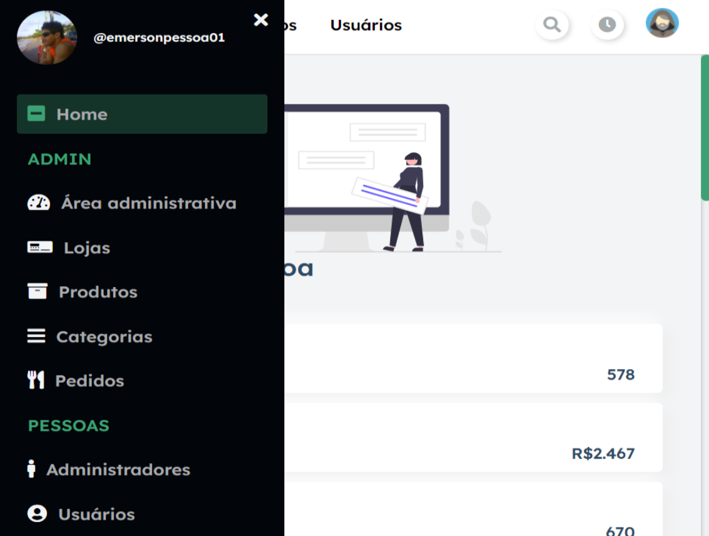
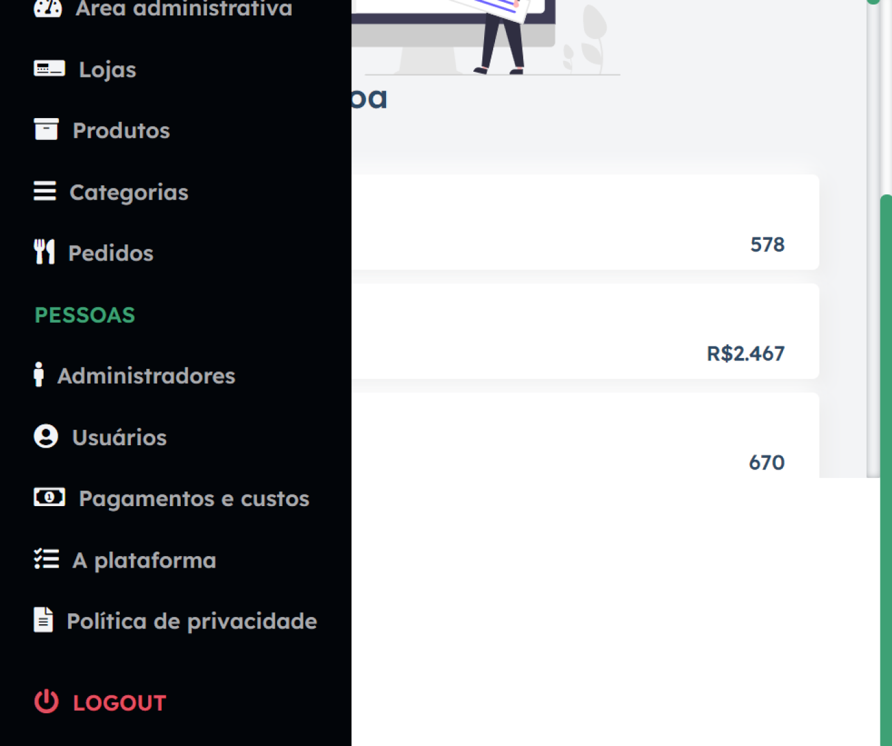
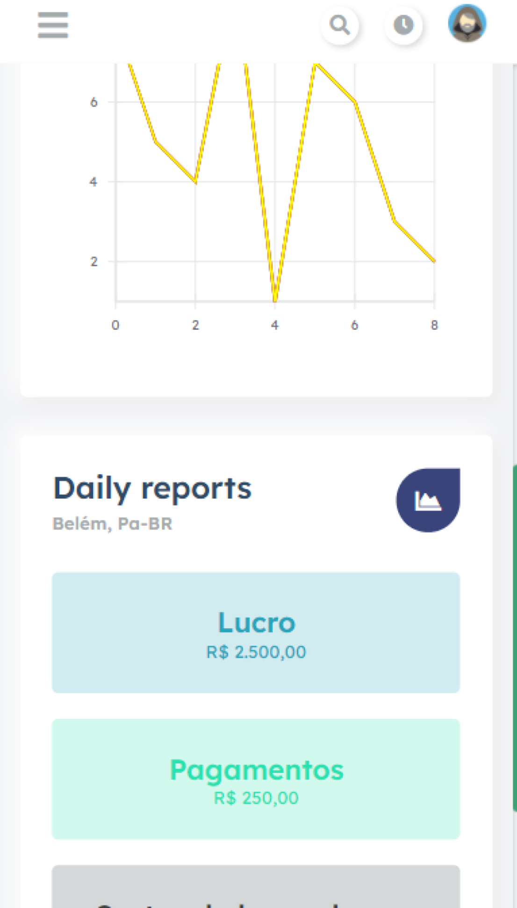
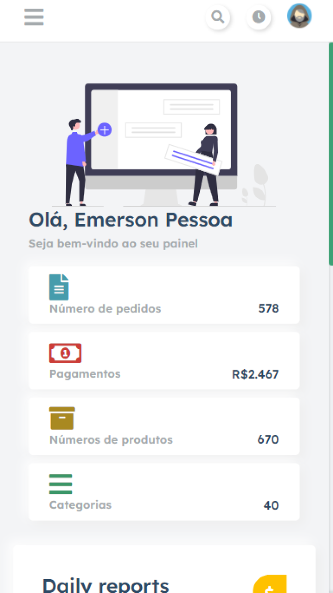
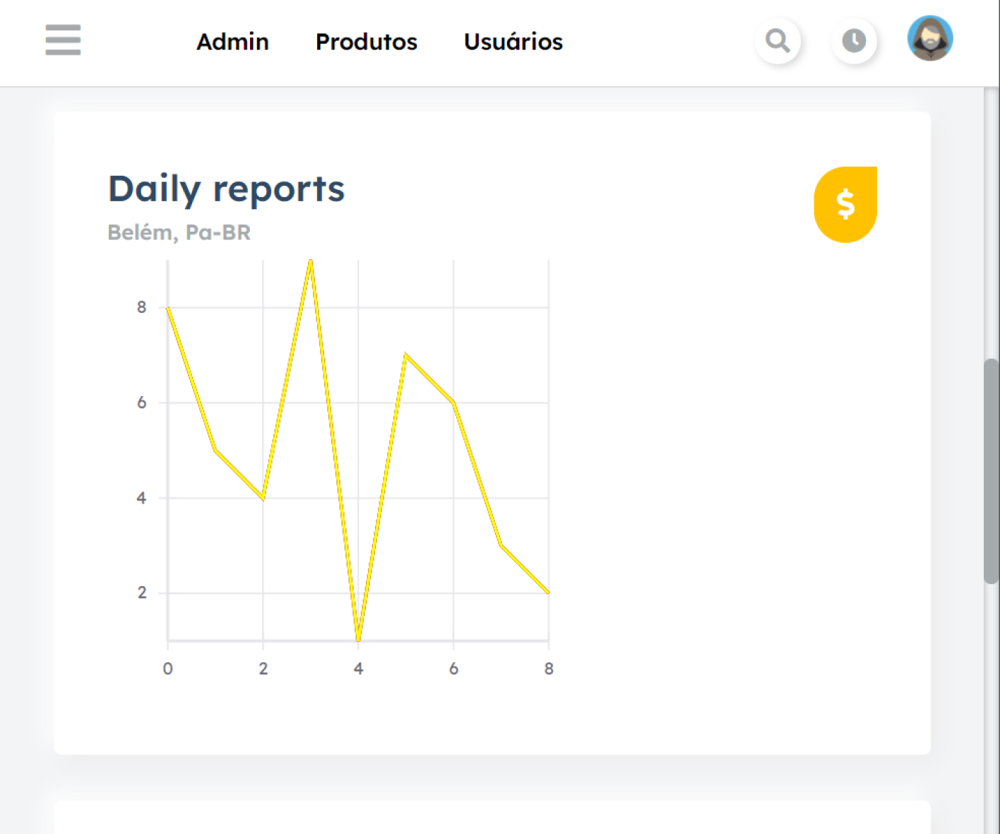

<h4 align="center">
     <b>Dashboard-admin</b>:copyright:
</h4>

 
     

     
     

     

[dashboard-admin-responsive](https://dashboard-admin-responsive.netlify.app/)

    
<h4> Preview: </h4>

|[   DASHBOARD_2 ]()    |
| :---: |

|[   DASHBOARD_3 ]()    | [   DASHBOARD_4 ]()  |
| :---: | :---: |

|[   DASHBOARD_5 ]()    | [   DASHBOARD_6 ]()  |
| :---: | :---: |

|[   DASHBOARD_7 ]()    |
| :---: |
